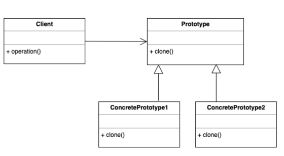

# Designpatter-Java

ALL IMPLEMENTATIONS ARE IN THE FOLDERS! 

## Factory

The Factory Method is a design pattern that provides an
interface for creating objects in a superclass, but allows
subclasses to alter the type of objects that will be created.

## Abstract Factory

## Prototype Pattern

Creates Instance of a Class to do something with it.
Shallow Copy - You have to use the (Typecast) super.clone(); Methode.
For the Deep Copy you have to overwrite the clone() Methode.

How it looks: 

## Adapter / Wrapper

Usage: Using mergin unknown classes with a class own written

Implementation:
In the Adapter class you create an object of a non supported class.
In the constructor you have to write the newly created object.
Lastly you implement the methode that the abstract class or interface
uses and manage how it should be handelt.

# Fassade

A fassade is a way to build around classes. Imagen you have 5 classes
and every time the class have to start in a exact order to manage
accessory and protect your programm from dumm people you build a fassade
around it. You write a class that calls all functions in the right order.

# Composite Pattern

More Objects that can be handled as one object
(Grouping objects)

# Visitor

# Decorator

Add features to a class without changing the class or to build 
subclasses.
